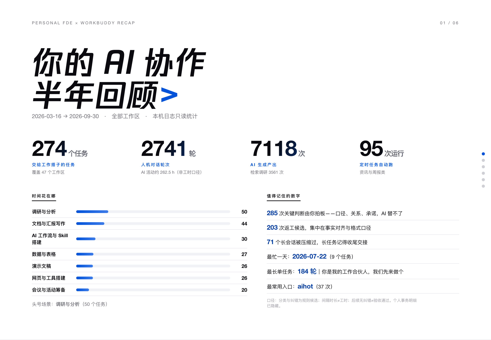
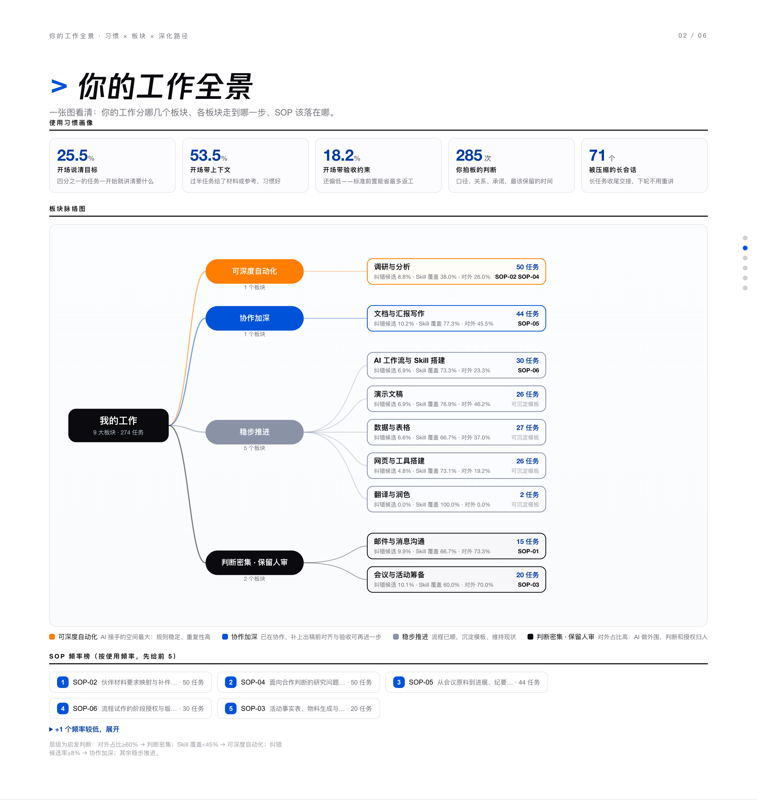
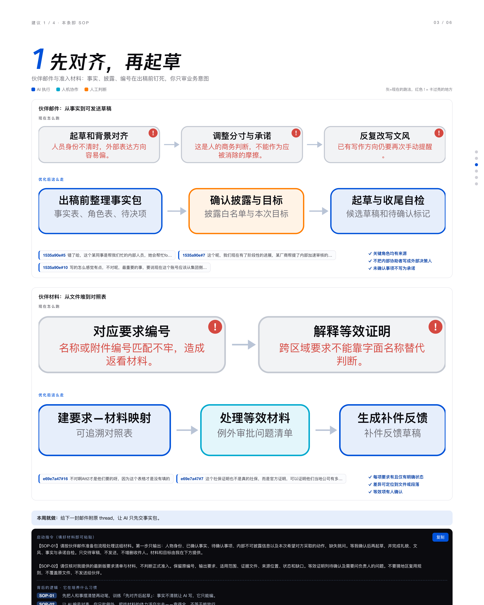
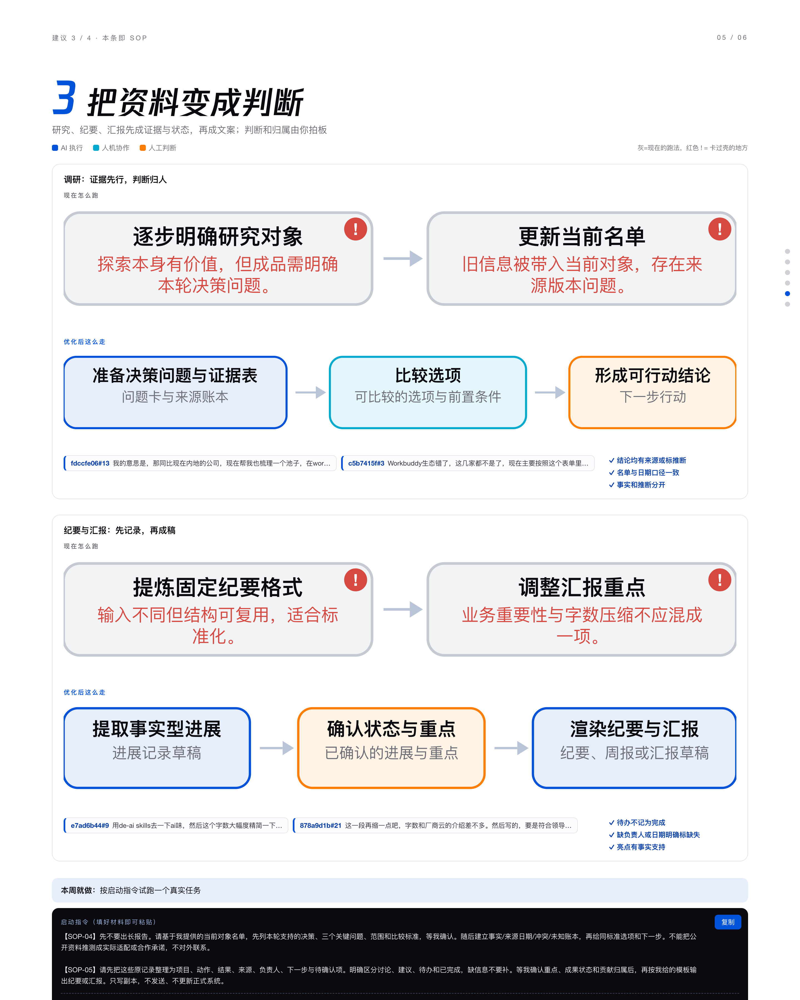
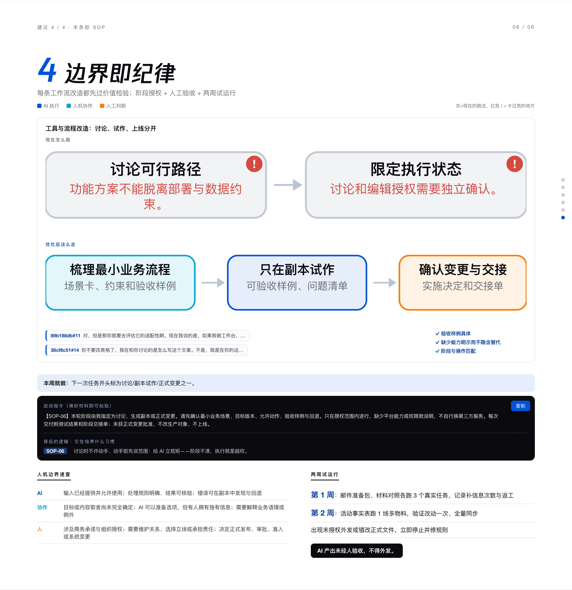

# personal-ai-fde

> **Don't count AI usage. Diagnose the workflow.**
> 把 AI 当工作搭子，而不是只统计使用次数 —— 只读扫描你的 AI 会话日志，还原真实工作流，告诉你哪一步能交给 AI、哪一步必须人拍板，并当场生成可试跑的 SOP。

   

An Agent Skill for [WorkBuddy](https://www.workbuddy.cn)（兼容 Claude Code / CodeBuddy 的 SKILL.md 规范）。纯 Python 标准库，零第三方依赖，零网络请求。

---

## 📸 Demo

**回顾总览**：半年协作一键还原 —— 274 个任务、2741 轮对话、7118 次 AI 产出，哪个板块最吃时间、哪个入口最常用，一眼看清。



**工作全景**：板块脑图 + 四层分层（可深度自动化 / 协作加深 / 稳步推进 / 判断密集·保留人工），每个板块标出纠错率、Skill 覆盖率、对外占比。



**流程改造建议**：每个工作环节上下两条流程图——现状卡点（标红）与优化后步骤（标分工），每个优化项挂真实证据编号，可点回原文。



**SOP 手册**：每个建议当场落成可复制启动指令的 SOP——触发、输入、人工关口、异常路径、验收、回退，全带。



**证据与历史**：全部结论可回溯到具体会话与轮次，周度对比同口径才判进步。



> 注：`docs/screenshots/` 为二进制资产，随 `.skill` 发布包分发，git 库中不收录。

## ✨ What it does

- 🔍 **只读扫描**：解析本机 WorkBuddy / Claude Code / CodeBuddy 主会话日志。382 个会话 401MB 全量约 8 秒，mtime 增量缓存重扫 <1 秒。
- 🧩 **还原业务工作流**：按业务成果聚类（不是按文件格式），逐环节区分 **AI 执行 / 人机协作 / 人工判断**，纠错候选、判断介入、对外信号全部计数。
- 📊 **生成诊断报告**：六节交互式 HTML——回顾总览、工作全景、流程改造建议、SOP 手册、证据与历史。
- 📋 **当场给 SOP**：每个可优化环节必须映射到一条完整 SOP（含可复制启动指令）。输出草案 ≠ 已部署，试跑验收才算数。
- 📈 **周度进步追踪**：快照 + 同口径护栏（范围一致 + ≥20h 间隔 + 指标版本一致才可比），同日重跑不判进步，杜绝「假进步」。
- 🛡️ **防幻觉强制校验**：数字一律脚本计算；分析引用必须能在扫描证据中找到（渲染器拒绝渲染）；run_id 严格绑定。

## 🧠 Design principles

这个 skill 的核心是一套**不信任链**：

| 不信任什么 | 怎么防 |
|---|---|
| 模型编造数字 | 数字全部脚本计算，模型不手填 |
| 模型引用不存在的证据 | 渲染器强制校验 evidence_refs，缺失即拒绝渲染 |
| 口径漂移伪装成进步 | scope_key + 时间间隔 + metric_version 三重护栏 |
| 日志里的注入攻击 | 剥离 20+ 类系统块，transcript 按不可信文本处理 |
| 脱敏静默失效 | 两层脱敏语义（数据层留原文供审计 / 展示层改写防误判），改写次数留痕 |
| 「没被骂」=「验收通过」 | 纠错候选率只作候选，验收必须人工确认 |

## 📦 Install

把 `personal-ai-fde/` 放入 skills 目录即可：

```bash
git clone https://github.com/Martinciao/Personal-Deployed-Engineer-.git
# 用户级
cp -r Personal-Deployed-Engineer-/skills/personal-ai-fde ~/.workbuddy/skills/personal-ai-fde
# 或项目级
cp -r Personal-Deployed-Engineer-/skills/personal-ai-fde <workspace>/.workbuddy/skills/personal-ai-fde
```

## 🚀 Quick start

```bash
PY=python3   # 或任意 Python ≥ 3.9，无需安装任何依赖

# 1. 全量扫描（首次）
$PY scripts/parse_sessions.py scan --all --out-dir ./outputs --history-dir ./.workbuddy/fde-history

# 2. 周度扫描（自动与上次同口径对比）
$PY scripts/parse_sessions.py scan --days 7 --exclude-current --out-dir ./outputs --history-dir ./.workbuddy/fde-history

# 3. 对外分享模式（置空原话与标题，防引文外泄）
$PY scripts/parse_sessions.py scan --days 7 --share-safe --out-dir ./outputs

# 4. 深挖某个会话（前 3 轮 + 纠错候选前后）
$PY scripts/parse_sessions.py session <id前缀> --focus

# 5. 分类器一致率标定（建议 ≥30 个标注样本）
$PY scripts/parse_sessions.py goldset goldset.tsv

# 6. 渲染报告（scan 后由 AI 写 analysis.json，再渲染）
$PY scripts/build_report.py --scan outputs/scan-<run_id>.json --analysis analysis.json --out report.html
$PY scripts/build_review.py --scan outputs/scan-<run_id>.json --analysis analysis.json --out review.html   # 最终展示版
```

也可以在 WorkBuddy 对话里直接说「帮我做一次 AI 使用复盘 / 个人 FDE 诊断」，skill 会自动接管整个流程。

## 🏗️ Architecture

```
会话日志(只读 ~/.workbuddy/projects/*/*.jsonl)
  │ parse_sessions.py scan        ← 8s 全量 / <1s 缓存增量
  ▼
scan.json（采集层：全量脱敏证据 + 指标 + 覆盖声明，run_id 唯一）
  │ 模型只读 digest(≤8KB) + session --focus 深挖 → 写 analysis.json（判断层）
  ▼
build_report.py / build_review.py（渲染器强制校验引用）
  ▼
六节 HTML 报告 + history 快照 → 周度 changes 同口径对比
```

三层 token 漏斗：**401MB 原始日志 → 8KB digest → 20KB/会话焦点深挖**。模型永远不读原始日志全文。

## 🔒 Security & Privacy

- **只读**：不修改、不移动、不删除任何会话日志；写入仅限显式指定的输出目录。
- **不联网**：纯标准库、零依赖、零网络请求；不装依赖、不建定时任务、不自动外发。
- **两层脱敏**：数据层做 PII 脱敏（邮箱/手机/证件/银行卡/URL 参数/≥20 位随机串）并保留安全拦截原文供审计；展示层改写拦截原文防宿主误判，改写次数记入 coverage.warnings。
- **个人事务默认隐藏**：`--include-personal` 才展示。
- **缓存有生命周期**：90 天 TTL 自动过期，`purge --yes` 手动清空。
- **诚实声明**：自动脱敏不保证识别全部商业秘密；云端模型场景下分析片段会进入模型上下文，不宣称完全离线。

## 🧪 Tests

```bash
python3 -m pytest tests/test_skill_v1.py -q   # 20 例：脱敏 / 转义 / 渲染校验 / 可比性护栏 / 纠错误判
```

## 📄 License

[MIT](LICENSE) © 2026 Martin Zhe

---

> **Disclaimer**: Demo 截图已做脱敏处理（人名与厂商名替换为泛称），数据来自真实使用场景。本 skill 为个人工作流诊断工具，不构成任何厂商官方评估标准。
